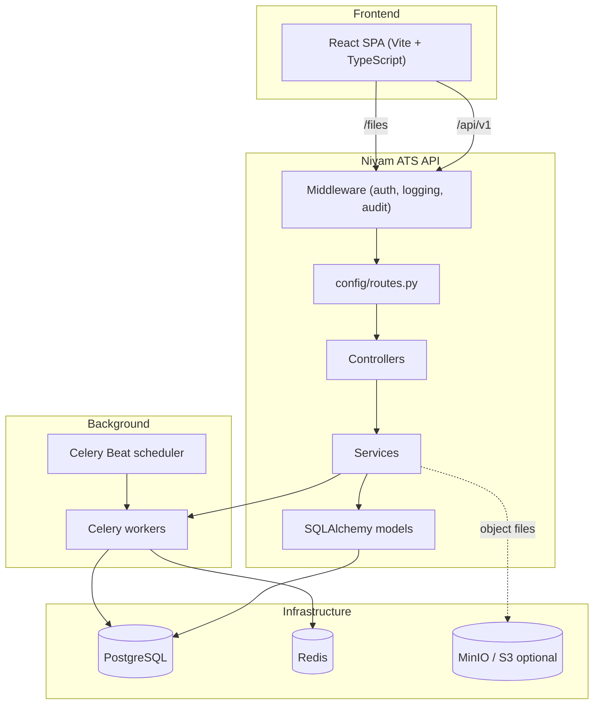

# Niyam ATS

<p align="center">
  
</p>

<p align="center">
  <strong>Open-source applicant tracking system for modern hiring teams.</strong>
</p>

<p align="center">
  Multi-workspace recruiting • configurable hiring pipelines • structured interviews • referrals • e-signatures • audit trail
</p>

<p align="center">
  <a href="https://www.python.org/downloads/"></a>
  <a href="https://fastapi.tiangolo.com/"></a>
  <a href="https://react.dev/"></a>
  <a href="https://www.typescriptlang.org/"></a>
  <a href="https://www.postgresql.org/"></a>
  <a href="https://redis.io/"></a>
  <a href="https://min.io/"></a>
</p>

---

## MinIO object storage

Niyam can store **job JD / attachment files**, **public apply resume uploads**, and other managed blobs on **[MinIO](https://min.io/)** (S3-compatible) instead of only on local disk. The API still exposes files at **`GET /files/...`**; when MinIO is enabled, those requests are streamed from your bucket.

Official docs: [MinIO Object Store](https://docs.min.io/community/minio-object-store/).

### What gets stored

| Flow | Endpoint / behavior |
|------|----------------------|
| Recruiter JD / documents | `POST /api/v1/jobs/{job_id}/attachments/upload` (multipart `file`, `name`, optional `doc_type`) |
| Public candidate resume file | `POST /api/v1/public/apply/{token}/resume` |
| Download | `GET http://<api-host>/files/...` (same path whether the backend uses disk or MinIO) |

JSON responses for attachments may include **`object_key`** (bucket object path) and **`file_storage`** (`minio` or `local`) so you can confirm behavior. Set **`PUBLIC_FILES_BASE_URL`** (for example `http://127.0.0.1:8000`) if clients need absolute `file_url` values (SPA on another origin, mobile apps, email links).

### Python dependency

The server uses the **`minio`** PyPI package (pinned in `requirements.txt`). Install with the same interpreter you use to run the API:

```bash
python manage.py deps
```

If `pip` is missing from your venv, `deps` runs **`python -m ensurepip`** first, then installs from `requirements.txt`. You can also use `python -m pip install -r requirements.txt`.

### Install MinIO Server (no Docker)

**Linux (amd64)** — download the binary, install to `/usr/local/bin`, use a data directory (example: `/mnt/data` or a path you own):

```bash
wget https://dl.min.io/server/minio/release/linux-amd64/minio
chmod +x minio
sudo mv minio /usr/local/bin/
sudo mkdir -p /mnt/data
export MINIO_ROOT_USER=admin
export MINIO_ROOT_PASSWORD='your-strong-password'
minio server /mnt/data --console-address ":9001"
```

**macOS (Homebrew)** — typical install:

```bash
brew install minio
mkdir -p ~/minio-data
export MINIO_ROOT_USER=admin
export MINIO_ROOT_PASSWORD='your-strong-password'
eval "$(/opt/homebrew/bin/brew shellenv)"
minio server ~/minio-data --console-address ":9001"
```

**Ports:** API / S3 endpoint defaults to **`9000`**. Web console defaults to **`9001`** (when `--console-address ":9001"` is set).

- API: `http://127.0.0.1:9000`
- Console: `http://127.0.0.1:9001`

### Configure Niyam (`.env`)

Copy `.env.example` → `.env`. Settings are loaded from **`<repo>/.env`** regardless of process working directory (`config/settings.py`).

When **all** of the following are non-empty, the app uses MinIO for new uploads and serves `/files/...` from the bucket:

| Variable | Example | Notes |
|----------|---------|--------|
| `MINIO_ENDPOINT` | `127.0.0.1:9000` | Host:port only (no `http://`). |
| `MINIO_ACCESS_KEY` | `admin` | Often same as `MINIO_ROOT_USER` for dev. |
| `MINIO_SECRET_KEY` | `your-strong-password` | Often same as `MINIO_ROOT_PASSWORD` for dev. |
| `MINIO_BUCKET` | `niyam` | Created automatically on API startup if missing. |
| `MINIO_USE_SSL` | `false` | Use `true` behind TLS. |
| `MINIO_REGION` | *(empty)* | Optional; set if your deployment requires it. |

**Optional:**

| Variable | Purpose |
|----------|---------|
| `PUBLIC_FILES_BASE_URL` | Prefix for absolute `file_url` / resume URLs in JSON (e.g. `http://127.0.0.1:8000`). |
| `JOB_ATTACHMENTS_DIR` | When MinIO is **disabled**, files go under this directory (default: `./storage/job_attachments/`). |

After changing `.env`, **restart the API** (settings are cached in process).

### Frontend dev (Vite)

`web/vite.config.ts` proxies **`/api`** and **`/files`** to the backend so relative `/files/...` links work from `http://localhost:5173`.

### Verify uploads

1. API logs should include a line like **`MinIO put_object ok`** after each successful S3 write.
2. Open the MinIO **Console** → bucket **`MINIO_BUCKET`** → find the object named like **`object_key`** from the API response.
3. `GET` the returned **`file_url`** in a browser or `curl`; you should receive the file bytes.

### Troubleshooting

| Symptom | What to check |
|---------|----------------|
| `ModuleNotFoundError: minio` | Run `python manage.py deps` with the **same** Python as `runserver`. |
| `pip` / `No module named pip` in venv | Use `python manage.py deps` (bootstraps pip via `ensurepip`). |
| MinIO process shows no HTTP lines | Normal; use console or API logs. |
| `file_storage` is `local` | `MINIO_*` not loaded—confirm `.env` in repo root and restart. |
| `command not found: minio` (macOS) | Add Homebrew to `PATH` or call `/opt/homebrew/bin/minio`. |

---

## Table of Contents

- [MinIO object storage](#minio-object-storage)
- [Why Niyam ATS](#why-niyam-ats)
- [Core Features](#core-features)
- [Hiring Flow](#hiring-flow)
- [Architecture](#architecture)
- [Tech Stack](#tech-stack)
- [Project Structure](#project-structure)
- [Quick Start](#quick-start)
- [Configuration](#configuration)
- [Common Commands](#common-commands)
- [Deployment](#deployment)
- [Contributing](#contributing)
- [License](#license)

---

## Why Niyam ATS

Niyam ATS is a full-stack hiring platform built for teams that need a reliable, extensible system beyond spreadsheets and fragmented tools.

- Multi-tenant workspace model with account-level data boundaries.
- FastAPI backend with service-oriented architecture.
- React + TypeScript frontend for a modern and responsive UI.
- Production-ready building blocks: JWT auth, async jobs, migration tooling, audit logging.

---

## Core Features

### Hiring workflow

- Job creation and lifecycle management (draft to archive).
- Per-job pipeline stage management (create, reorder, update, delete).
- Candidate application tracking across stages.
- Labels, metadata, and custom attributes for richer triage.

### Interviews and evaluation

- Interview plans and interview kits.
- Assignee workflows and scorecard submissions.
- Debrief-friendly evaluation aggregation.

### Referral and collaboration

- Per-job referral links and referral activity tracking.
- Team-level views for collaboration and operations.

### E-signatures and compliance

- E-sign template management and stage-triggered automation.
- Tokenized candidate signing flow and signed-document lifecycle.
- Audit streams and compliance-focused visibility.

---

## Hiring Flow

This is the default end-to-end hiring journey teams can run on Niyam ATS.

### 1) Role kickoff and requisition setup

- Create a new role and define business context (team, location, budget, level, priorities).
- Configure the hiring manager and recruiter ownership.
- Add hiring stages for the role (for example: `Applied`, `Screening`, `Hiring Manager`, `Onsite`, `Offer`, `Hired`).
- Attach required skills, nice-to-have skills, and custom attributes for better qualification.

### 2) Job publishing and intake

- Publish jobs to your internal or external boards.
- Capture inbound candidates through direct apply, referrals, or manual sourcing.
- Automatically map each candidate to the initial pipeline stage.

### 3) Pipeline management

- Recruiters and hiring managers move candidates stage-by-stage.
- Add, rename, reorder, or remove stages as the role process evolves.
- Use labels, filters, and metadata to keep triage clean and collaborative.

### 4) Interview orchestration

- Create interview plans and interview kits per role.
- Assign interviewers, claim open slots, and track interview ownership.
- Collect structured scorecards to keep evaluations consistent.

### 5) Debrief and decision

- Consolidate scorecards and interviewer feedback in one place.
- Run hiring debriefs with role-specific signals and evidence.
- Move selected candidates to offer while preserving audit history.

### 6) Offer, e-sign, and close

- Trigger e-sign requests manually or from stage-based automation rules.
- Candidate completes tokenized signing flow.
- Signed documents are stored and linked back to candidate/application records.

### 7) Compliance and reporting

- Track critical actions through audit logs and delivery-failure visibility.
- Review referral performance and bonus operations.
- Use account-scoped data for secure multi-workspace operations.

### Typical pipeline lifecycle

`Kickoff -> Job Published -> Candidate Applied -> Screening -> Interview Loop -> Debrief -> Offer -> E-sign -> Hired`

---

## Architecture



---

## Tech Stack

- Backend: Python 3.11+, FastAPI, SQLAlchemy 2.0, Alembic.
- Frontend: React 19, TypeScript, Vite.
- Database: PostgreSQL.
- Queue/async: Celery + Redis.
- Object storage (optional): [MinIO](https://min.io/) S3-compatible API via the `minio` Python client; local disk fallback under `storage/job_attachments/`.
- Auth/security: JWT, Passlib/bcrypt.
- Tooling: `manage.py` CLI, pytest, ESLint, TypeScript build checks.

---

## Project Structure

```text
.
├── app/                    # Controllers, services, models, jobs, middleware
├── config/                 # Settings, routes, DB config, celery, schedule
├── db/migrations/versions/ # Alembic migrations
├── web/                    # React SPA (build output goes to ../static)
├── static/                 # Built frontend assets
├── tests/                  # Backend tests
├── main.py                 # FastAPI app entry
└── manage.py               # CLI for server, db, workers, generators
```

---

## Quick Start

### 1) Backend setup

```bash
python3 -m venv .venv
source .venv/bin/activate
python manage.py deps
cp .env.example .env
cp config/database.yml.example config/database.yml
python manage.py db:migrate
python manage.py runserver
```

`python manage.py deps` runs `python -m pip install -r requirements.txt` (and bootstraps `pip` via `ensurepip` if needed). Use it whenever plain `pip` is not on your `PATH`.

Backend runs at `http://localhost:8000`.

**Optional:** start [MinIO](#minio-object-storage), then add `MINIO_*` variables to `.env` before `runserver` so JD and resume files go to object storage.

### 2) Frontend setup

```bash
cd web
npm install
npm run dev
```

Frontend runs at `http://localhost:5173` and proxies `/api` to the backend.

---

## Configuration

Copy `.env.example` to `.env` and set at least:

- `APP_ENV`, `DEBUG`
- `SECRET_KEY`, `JWT_SECRET_KEY`
- `DATABASE_URL` (or use `config/database.yml`)
- `REDIS_URL`
- `FRONTEND_PUBLIC_URL`

**MinIO (optional):** see the [MinIO object storage](#minio-object-storage) section at the top of this README for install steps, `.env` variables (`MINIO_ENDPOINT`, keys, bucket, `PUBLIC_FILES_BASE_URL`), and verification.

Optional integrations:

- `GOOGLE_OAUTH_*` for Gmail/OAuth flows.
- `AUDIT_LOG_*` for buffered audit behavior.
- `ESIGN_*` for e-sign storage and artifact controls.

---

## Common Commands

### Backend

```bash
python manage.py deps
python manage.py runserver
python manage.py routes
python manage.py shell
python manage.py db:migrate
python manage.py db:rollback
python manage.py db:seed
python manage.py worker
python manage.py scheduler
```

### Frontend

```bash
cd web
npm run dev
npm run build
npm run lint
```

### Tests

```bash
pytest tests/ -v
```

---

## Deployment

Recommended production sequence:

1. Set production env values (`APP_ENV`, `DEBUG=false`, secrets, DB, Redis, CORS).
2. Run migrations: `python manage.py db:migrate`.
3. Build frontend: `cd web && npm ci && npm run build`.
4. Run API with production ASGI workers.
5. Run Celery workers and scheduler.
6. Serve `static/` via reverse proxy or CDN.
7. Run **MinIO** (or any S3-compatible endpoint), set `MINIO_*` with strong credentials and `MINIO_USE_SSL=true` when TLS terminates on the object store; set `PUBLIC_FILES_BASE_URL` to your public API origin so attachment URLs resolve for candidates and integrations.

---

## Contributing

Contributions are welcome.

1. Fork the repository.
2. Create a branch: `git checkout -b feat/your-change`.
3. Keep changes scoped and add/update tests when needed.
4. Run checks locally (`pytest`, `npm run build`, `npm run lint`).
5. Open a pull request with clear context and verification notes.

Please follow the project conventions in `.cursor/rules/niyam-conventions.mdc`.

---

## License

See `pyproject.toml` and your organization policy for license details.
