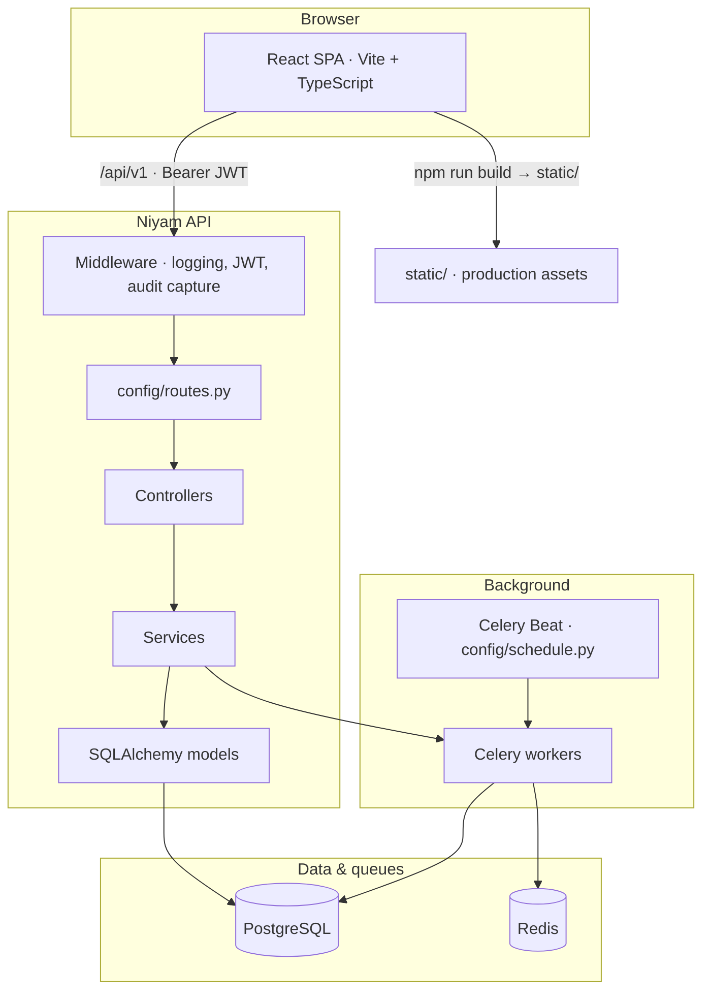

<div align="center">


<br />

**Applicant tracking for teams that outgrow spreadsheets.**

Multi-account workspaces · configurable hiring pipeline · structured interviews · e-signatures · referrals · audit trail

<br />

[](https://www.python.org/downloads/)
[](https://fastapi.tiangolo.com/)
[](https://react.dev/)
[](https://www.typescriptlang.org/)
[](https://vitejs.dev/)
[](https://www.postgresql.org/)
[](https://redis.io/)
[](https://docs.celeryq.dev/)

<br />

[Capabilities](#platform-capabilities) · [Quick start](#quick-start) · [Architecture](#architecture) · [Tech stack](#tech-stack) · [Repository layout](#repository-layout) · [Configuration](#configuration) · [Deployment](#deployment)

</div>

---

## Overview

**Niyam** is a full-stack ATS: a **FastAPI** and **PostgreSQL** API with a **React** SPA. Features are wired through `config/routes.py` on the backend and `web/src/` on the frontend—what follows reflects what exists in this repository today.

---

## Platform capabilities

### Authentication & workspace

- **Sign-in & sessions** — Email/password login with access and refresh JWT flow.
- **Profile** — Authenticated user profile for the signed-in recruiter.
- **Multi-account** — Data scoped per workspace (`account_id`); members see only their account.
- **Team directory** — Account members for collaboration and permissions context.

### Jobs & hiring plans

- **Jobs** — Create, list, show, update, and archive jobs (title, department, location, compensation, skills, employment type, experience, hiring team, and more).
- **Job versions** — Version history per job: list, create, and update snapshots as the requisition evolves.
- **Attachments** — Upload, list, and remove files on a job.
- **Job analytics** — Per-job metrics for funnel and activity.
- **Hiring plan per job** — Structured hiring plan linked to each requisition.
- **Labels on jobs** — Tag requisitions for reporting and filtering.
- **Referral link per job** — Shareable referral URLs tied to a specific opening.

### Career presence: boards & postings

- **Job boards** — Internal or external boards that organize how roles are published.
- **Postings** — Create and manage postings so approved jobs surface where candidates apply.

### Pipeline & applications

- **Pipeline stages** — Define stages per job; reorder to match your process.
- **Applications** — List, view, create, and remove applications; update candidate-facing fields.
- **Move on pipeline** — Change an application’s stage as candidates progress.
- **Labels on applications** — Tag candidates and applications for triage and reporting.
- **Hiring plans (workspace)** — Workspace-level hiring plan resources alongside per-job plans.
- **Candidates view** — Dedicated workspace view for the candidate pool.

### Interviews, kits & scorecards

- **Interview plans per job** — CRUD for plans bound to a job.
- **Interview kits** — Structured kits (questions, focus areas) for a plan on a job.
- **My interview assignments** — Interviewers see work assigned to them.
- **Claim assignments** — Pick up open interview slots when your process allows it.
- **Live interview kit** — Load the kit during an in-flight assignment.
- **Submit scorecards** — Structured feedback after each interview.
- **Update assignments** — Reschedule, reassign, or adjust interview state.
- **Scorecards by application** — Consolidated scorecard history for one candidate record.
- **Hiring debrief** — Job-level debrief across scorecards for panel alignment.

### Referral program

- **Referral program settings** — Configure bonuses, messaging, and policy.
- **Referral bonuses** — List rows, update payouts/status, **export CSV** for finance.
- **Leaderboard** — Rank referrers.
- **My referrals** — Employees see referrals they originated.
- **Admin overview** — Operations view for program health and volume.
- **Referrals hub** — UI area for referral activity (`/referrals`).

### E-signatures

- **Account e-sign settings** — Workspace defaults for branding and behavior.
- **HTML templates** — Full CRUD for agreement bodies rendered to candidates.
- **Stage rules** — Automate signing requests from pipeline stage changes.
- **Signing requests** — List requests; generate packages for a given application.
- **Public signing** — Tokenized signing page (no recruiter login) with legal name and signature pad.
- **Signed PDF download** — Candidates download executed agreements when available.
- **E-sign webhooks** — Inbound endpoint for provider-style integrations.
- **Signed documents library** — Workspace UI for completed agreements (`/esign-documents`).
- **Settings workspace** — Overview, template editor, rules, and advanced e-sign screens.

### Organization, data model & communications

- **Organization** — Legal name, timezone, locale, and core company profile.
- **Departments** — Structure hiring by department for jobs and reporting.
- **Job locations** — Curated locations for consistent job ads and filters.
- **Workspace metadata** — Additional workspace-level configuration.
- **Appearance** — Typography and presentation settings.
- **Custom attribute definitions** — Typed custom fields for **jobs** and **applications**.
- **Labels** — Workspace-wide labels with create, update, and archive flows.
- **Communication channels** — Multiple outbound email channels, **test send**, **set default**.
- **Gmail OAuth** — Connect Google mail via OAuth.
- **Countries reference** — API-backed country list for forms and pickers.

### Audit & compliance

- **Audit trail settings** — Toggle and tune how audit events are captured.
- **Audit log** — Paginated, filterable history of sensitive actions.
- **Delivery failures** — Visibility when audit or notification delivery fails.
- **Compliance summary** — Account-level compliance endpoint for dashboards and exports.
- **Admin UI** — Overview, audit log browser, and delivery-failure pages under settings.

### Candidate-facing experience

- **Public job apply** — Branded apply page by token: load job, submit application, confirmation UX.
- **Public e-sign** — Token-based signing for agreements triggered from your process.

### Platform operations

- **Health check** — `GET /health` for load balancers and monitors.
- **OpenAPI** — Interactive docs when `DEBUG=true`.
- **PostgreSQL + Alembic** — Migrations and relational integrity.
- **Celery + Redis** — Background work: e-sign delivery, label search sync, audit flush, and other async jobs.
- **PDF pipeline** — **WeasyPrint** when system libs exist, **fpdf2** fallback otherwise.
- **Buffered audit** — Optional Redis-backed buffering with scheduled flush to PostgreSQL for high-volume writes.

---

## Architecture



| Surface | Role |
|--------|------|
| `main.py` | FastAPI application, middleware, `/health`. |
| `config/routes.py` | Central route table for every HTTP endpoint. |
| `web/` | SPA; dev server proxies `/api` to the API; `vite.config.ts` emits `static/`. |
| `app/jobs/` | Async tasks: e-sign, indexing, audit flush, and more. |

---

## Tech stack

| Layer | Choices |
|-------|---------|
| **Runtime** | Python 3.11+ |
| **HTTP** | FastAPI, Uvicorn |
| **Data** | SQLAlchemy 2.0, Alembic, PostgreSQL (`psycopg2`) |
| **Config** | Pydantic Settings (`.env`), YAML (`config/database.yml`) |
| **Auth** | JWT (`python-jose`), Passlib + bcrypt |
| **Queue** | Celery, Redis, gevent worker pool (tunable) |
| **PDF** | WeasyPrint (optional system libs), **fpdf2** fallback |
| **CLI** | Click (`manage.py`) |
| **UI** | React 19, React Router 7, TipTap, `@dnd-kit` |

---

## Repository layout

```
.
├── main.py                 # FastAPI app, middleware, health
├── manage.py               # CLI: runserver, db:*, worker, scheduler, shell, routes
├── requirements.txt
├── pyproject.toml          # fastforge scaffold CLI metadata
├── alembic.ini
├── .env.example
│
├── config/                 # settings, database, routes, celery, schedule, logging
├── app/                    # controllers, models, services, jobs, middleware, schemas
├── db/migrations/versions/
├── web/                    # React SPA → build to ../static
├── static/                 # Production frontend (from npm run build)
├── docs/readme/            # README brand assets
└── tests/
```

---

## Quick start

```bash
# Python
python3 -m venv .venv
source .venv/bin/activate   # Windows: .venv\Scripts\activate
pip install -r requirements.txt

# Environment
cp .env.example .env
# Set SECRET_KEY, JWT_SECRET_KEY, DATABASE_URL or database.yml

cp config/database.yml.example config/database.yml

# Database
python manage.py db:migrate
python manage.py db:seed    # optional

# API
python manage.py runserver
# Health: http://localhost:8000/health
# OpenAPI (DEBUG=true): http://localhost:8000/docs
```

**Frontend (development)**

```bash
cd web && npm install && npm run dev
# http://localhost:5173 — proxies /api → http://localhost:8000
```

Set **`FRONTEND_PUBLIC_URL`** in `.env` (for example `http://localhost:5173`) for OAuth return URLs and public flows that need the SPA origin.

| Command | Purpose |
|---------|---------|
| `npm run dev` | Vite dev server, `/api` → backend |
| `npm run build` | Typecheck + bundle → `../static/` |
| `npm run lint` | ESLint |

---

## Configuration

Copy **`.env.example`** → **`.env`**. Notable variables:

| Variable | Purpose |
|----------|---------|
| `APP_NAME` / `APP_ENV` / `DEBUG` | Identity, environment, OpenAPI when debug |
| `SECRET_KEY` | App secret |
| `DATABASE_URL` | Overrides `config/database.yml` if set |
| `JWT_*` | Signing and token lifetimes |
| `REDIS_URL` | General Redis |
| `CELERY_*` | Broker, backend, pool, concurrency |
| `FRONTEND_PUBLIC_URL` | SPA origin for OAuth and public links |
| `GOOGLE_OAUTH_*` | Gmail integration |
| `AUDIT_LOG_*` | Optional Redis buffering for audit payloads |
| `ESIGN_*` | Optional e-sign artifact directories |

**`config/database.yml`** — Per-environment DB config; **`APP_ENV`** selects the section merged with `default`.

<details>
<summary><strong>Database CLI</strong> (migrations, seed, reset)</summary>

| Command | Description |
|---------|-------------|
| `python manage.py db:create` | Create DB from config |
| `python manage.py db:migrate` | Alembic upgrade head |
| `python manage.py db:rollback` | Roll back (see `--step`, `--to`) |
| `python manage.py db:status` | Current revision |
| `python manage.py db:history` | History |
| `python manage.py db:seed` | Run `db/seeds.py` |
| `python manage.py db:reset` | Downgrade all → migrate → seed |

New migration:

```bash
python manage.py generate migration <description>
# Edit db/migrations/versions/YYYYMMDD_HHMMSS_<description>.py
python manage.py db:migrate
```

</details>

<details>
<summary><strong>Background jobs (Celery)</strong></summary>

| Process | Command |
|---------|---------|
| Worker | `python manage.py worker` (optional `--queue=name`) |
| Beat only | `python manage.py scheduler` |

By default **`worker`** also runs **Beat** unless **`--no-beat`**. Workers default to **gevent** with high concurrency; tune **`CELERY_WORKER_POOL`** / **`CELERY_WORKER_CONCURRENCY`** for CPU- or DB-heavy loads.

Typical tasks: e-sign (merge HTML, links, PDF packaging), label search document sync, audit flush Redis → PostgreSQL. Some paths fall back to **inline** execution if Redis or enqueue fails.

</details>

<details>
<summary><strong>API shape & code organization</strong></summary>

- Base path: **`/api/v1`** (`config/routes.py`).
- **`GET /health`** — unauthenticated.
- **`/docs`**, **`/redoc`** — when **`DEBUG=true`**.
- JSON envelope: **`success`**, **`data`**, **`meta`**, **`error`** via controller helpers.
- **Routes:** registered only in **`config/routes.py`**.
- **Controllers:** concerns such as **`Authenticatable`**, **`@before_action`**, **`render_json` / `render_error`**.
- **Services:** return **`{"ok": true/false, ...}`** — avoid raising HTTP exceptions inside services.
- **Models:** SQLAlchemy **`Mapped` / `mapped_column`**, tenant **`account_id`**, **`to_dict()`** for API payloads.

Contributor patterns: **`.cursor/rules/niyam-conventions.mdc`**.

</details>

<details>
<summary><strong>CLI reference</strong></summary>

| Command | Description |
|---------|-------------|
| `python manage.py runserver [--port] [--host]` | Uvicorn + reload |
| `python manage.py routes` | List routes |
| `python manage.py shell` | REPL with `db` and models |
| `python manage.py worker` | Celery worker |
| `python manage.py scheduler` | Celery Beat |
| `python manage.py generate migration \| controller \| model \| job \| service` | Scaffolds |

`manage.py` accepts **`db:migrate`** or **`db migrate`**.

</details>

<details>
<summary><strong>Testing</strong></summary>

```bash
pytest tests/ -v
```

Optional coverage:

```bash
pip install pytest-cov
pytest tests/ -v --cov=app --cov-report=term-missing
```

</details>

---

## Deployment

1. Set **`APP_ENV`**, **`DEBUG=false`**, strong **`SECRET_KEY`** and **`JWT_SECRET_KEY`**, production **`DATABASE_URL`** / **`database.yml`**, Redis for Celery and audit.
2. Run **`python manage.py db:migrate`**.
3. Run the API with a production ASGI stack (for example **Gunicorn + Uvicorn** workers).
4. Run **Celery workers** and a dedicated **Beat** process if you use **`--no-beat`** on workers.
5. Serve **`static/`** (from `web/`: **`npm run build`**) via reverse proxy or CDN; tighten **CORS** in production (`main.py`).

---

## Optional: fastforge scaffold CLI

This repo includes a **`fastforge`** package in **`pyproject.toml`**. Install in editable mode if you use generators:

```bash
pip install -e .
fastforge new my_app
fastforge generate model MyModel
```

Generated layouts may differ from this monolith; this README describes the **Niyam ATS** application.

---

## License

See **`pyproject.toml`** (MIT for the bundled **fastforge** CLI). Application code: follow your organization’s policy.
