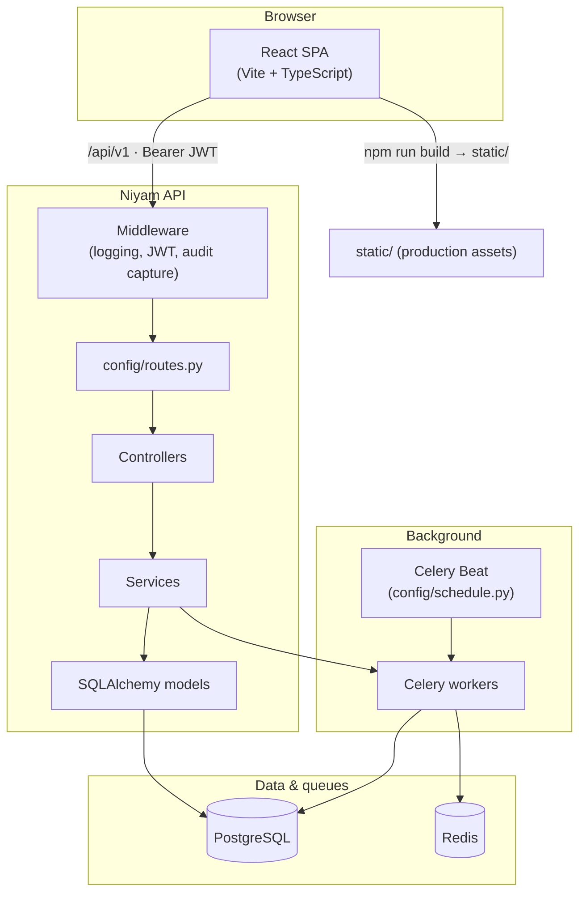

<p align="center">
  
</p>

<p align="center">
  <b>Applicant tracking for teams that outgrow spreadsheets.</b><br />
  Multi-account workspaces, hiring pipeline, structured interviews, e-signatures, referrals, and audit-ready operations — backed by a Rails-style FastAPI core and a React SPA.
</p>

<p align="center">
  <a href="https://www.python.org/downloads/"></a>
  <a href="https://fastapi.tiangolo.com/"></a>
  <a href="https://react.dev/"></a>
  <a href="https://www.typescriptlang.org/"></a>
  <a href="https://vitejs.dev/"></a>
  
  
  
</p>

<p align="center">
  <a href="#quick-start">Quick start</a>
  &nbsp;·&nbsp;
  <a href="#features">Features</a>
  &nbsp;·&nbsp;
  <a href="#architecture">Architecture</a>
  &nbsp;·&nbsp;
  <a href="#tech-stack">Tech stack</a>
  &nbsp;·&nbsp;
  <a href="#repository-layout">Layout</a>
  &nbsp;·&nbsp;
  <a href="#configuration">Configuration</a>
  &nbsp;·&nbsp;
  <a href="#deployment">Deployment</a>
</p>

---

## Features

<table>
<tr>
<td width="50%" valign="top">

**Hiring & pipeline**  
Jobs with versions, boards, visibility, compensation, skills, and hiring team. Applications with **public apply** links, configurable **pipeline stages**, and automation toward the next step.

**Interviews & quality**  
Interview plans, rounds, kits, assignments, and **scorecards** so feedback stays structured and comparable across candidates.

**Referrals**  
Program settings, bonuses, analytics, and share links so employees can drive sourcing without losing attribution.

</td>
<td width="50%" valign="top">

**E-sign**  
Stage-triggered signing requests, HTML templates, webhooks, and **signed PDF packages** (WeasyPrint with fpdf2 fallback when system libs are unavailable).

**Workspace**  
Organization settings (departments, countries, default currency), **labels**, **custom attributes** on jobs and candidates, members, and appearance (typography).

**Operations**  
JWT authentication, **audit log buffering** (Redis) with scheduled flush to PostgreSQL, and communication channels (e.g. **Gmail OAuth**).

</td>
</tr>
</table>

**API design** — HTTP handlers stay thin: **controllers** enforce auth and params, **services** own queries and rules and return `success` / `failure` results, **models** use SQLAlchemy 2 with tenant **`account_id`** where required. All routes live in **`config/routes.py`**.

---

## Architecture



| Surface | Role |
|--------|------|
| **`main.py`** | FastAPI app factory, middleware stack, **`/health`**. |
| **`config/routes.py`** | Single registry for every HTTP route (`draw_routes`, `resources`, `_wrap`). |
| **`web/`** | SPA; dev server proxies **`/api`** to the API; **`vite.config.ts`** outputs to **`static/`**. |
| **`app/jobs/`** | Async work: e-sign delivery, label search indexing, audit flush, etc. |

---

## Tech stack

| Layer | Choices |
|-------|---------|
| **Runtime** | Python 3.11+ |
| **HTTP** | FastAPI, Uvicorn |
| **Data** | SQLAlchemy 2.0, Alembic, PostgreSQL (`psycopg2`) |
| **Config** | Pydantic Settings (`.env`), YAML (`config/database.yml`) |
| **Auth** | JWT (`python-jose`), Passlib + bcrypt |
| **Queue** | Celery, Redis, gevent worker pool (tunable) |
| **PDF** | WeasyPrint (optional system libs), **fpdf2** fallback |
| **CLI** | Click (`manage.py`) |
| **UI** | React 19, React Router 7, TipTap, `@dnd-kit` |

---

## Repository layout

```
.
├── main.py                 # FastAPI app, middleware, health
├── manage.py               # CLI: runserver, db:*, worker, scheduler, shell, routes
├── requirements.txt
├── pyproject.toml          # fastforge scaffold CLI metadata
├── alembic.ini
├── .env.example
│
├── config/                 # settings, database, routes, celery, schedule, logging
├── app/                    # controllers, models, services, jobs, middleware, schemas
├── db/migrations/versions/
├── web/                    # React SPA → build to ../static
├── static/                 # Production frontend (from npm run build)
├── docs/readme/            # README brand assets (tight-crop wordmark; optional mark)
└── tests/
```

---

## Quick start

```bash
# Python
python3 -m venv .venv
source .venv/bin/activate   # Windows: .venv\Scripts\activate
pip install -r requirements.txt

# Environment
cp .env.example .env
# Set SECRET_KEY, JWT_SECRET_KEY, DATABASE_URL or database.yml

cp config/database.yml.example config/database.yml

# Database
python manage.py db:migrate
python manage.py db:seed    # optional

# API
python manage.py runserver
# Health: http://localhost:8000/health
# OpenAPI (DEBUG=true): http://localhost:8000/docs
```

**Frontend (development)**

```bash
cd web && npm install && npm run dev
# http://localhost:5173 — proxies /api → http://localhost:8000
```

Set **`FRONTEND_PUBLIC_URL`** in `.env` (e.g. `http://localhost:5173`) for OAuth return URLs and public flows that need the SPA origin.

| Command | Purpose |
|---------|---------|
| `npm run dev` | Vite dev server, `/api` → backend |
| `npm run build` | Typecheck + bundle → **`../static/`** |
| `npm run lint` | ESLint |

---

## Configuration

Copy **`.env.example`** → **`.env`**. Notable variables:

| Variable | Purpose |
|----------|---------|
| `APP_NAME` / `APP_ENV` / `DEBUG` | Identity, environment, OpenAPI when debug |
| `SECRET_KEY` | App secret |
| `DATABASE_URL` | Overrides `config/database.yml` if set |
| `JWT_*` | Signing and token lifetimes |
| `REDIS_URL` | General Redis |
| `CELERY_*` | Broker, backend, pool, concurrency |
| `FRONTEND_PUBLIC_URL` | SPA origin for OAuth and public links |
| `GOOGLE_OAUTH_*` | Gmail integration |
| `AUDIT_LOG_*` | Optional Redis buffering for audit payloads |
| `ESIGN_*` | Optional e-sign artifact directories |

**`config/database.yml`** — per-environment DB config; **`APP_ENV`** selects the section merged with `default`.

<details>
<summary><b>Database CLI</b> (migrations, seed, reset)</summary>

| Command | Description |
|---------|-------------|
| `python manage.py db:create` | Create DB from config |
| `python manage.py db:migrate` | Alembic upgrade head |
| `python manage.py db:rollback` | Roll back (see `--step`, `--to`) |
| `python manage.py db:status` | Current revision |
| `python manage.py db:history` | History |
| `python manage.py db:seed` | Run `db/seeds.py` |
| `python manage.py db:reset` | Downgrade all → migrate → seed |

New migration:

```bash
python manage.py generate migration <description>
# Edit db/migrations/versions/YYYYMMDD_HHMMSS_<description>.py
python manage.py db:migrate
```

</details>

<details>
<summary><b>Background jobs (Celery)</b></summary>

| Process | Command |
|---------|---------|
| Worker | `python manage.py worker` (optional `--queue=name`) |
| Beat only | `python manage.py scheduler` |

By default **`worker`** also runs **Beat** unless **`--no-beat`**. Workers default to **gevent** with high concurrency; tune **`CELERY_WORKER_POOL`** / **`CELERY_WORKER_CONCURRENCY`** for CPU- or DB-heavy loads.

Typical tasks: e-sign (merge HTML, links, PDF packaging), label search document sync, audit flush Redis → PostgreSQL. Some paths fall back to **inline** execution if Redis or enqueue fails.

</details>

<details>
<summary><b>API & conventions</b></summary>

- Base path: **`/api/v1`** (`config/routes.py`).
- **`GET /health`** — unauthenticated.
- **`/docs`**, **`/redoc`** — when **`DEBUG=true`**.
- JSON envelope: **`success`**, **`data`**, **`meta`**, **`error`** via controller helpers.
- **Routes:** only `config/routes.py`.
- **Controllers:** `Authenticatable`, `@before_action`, `render_json` / `render_error`.
- **Services:** `{"ok": true/false, ...}` — no HTTP exceptions inside services.
- **Models:** `Mapped` / `mapped_column`, **`account_id`** for tenants, **`to_dict()`** for API shapes.

Editor guidance: **`.cursor/rules/niyam-conventions.mdc`**.

</details>

<details>
<summary><b>CLI reference</b></summary>

| Command | Description |
|---------|-------------|
| `python manage.py runserver [--port] [--host]` | Uvicorn + reload |
| `python manage.py routes` | List routes |
| `python manage.py shell` | REPL with `db` and models |
| `python manage.py worker` | Celery worker |
| `python manage.py scheduler` | Celery Beat |
| `python manage.py generate migration \| controller \| model \| job \| service` | Scaffolds |

`manage.py` accepts **`db:migrate`** or **`db migrate`**.

</details>

<details>
<summary><b>Testing</b></summary>

```bash
pytest tests/ -v
```

Optional coverage:

```bash
pip install pytest-cov
pytest tests/ -v --cov=app --cov-report=term-missing
```

</details>

---

## Deployment

1. Set **`APP_ENV`**, **`DEBUG=false`**, strong **`SECRET_KEY`** and **`JWT_SECRET_KEY`**, production **`DATABASE_URL`** / **`database.yml`**, Redis for Celery and audit.
2. **`python manage.py db:migrate`**.
3. Run the API with a production ASGI stack (e.g. **Gunicorn + Uvicorn** workers).
4. Run **Celery workers** and a dedicated **Beat** process if you use **`--no-beat`** on workers.
5. Serve **`static/`** (from `web/`: **`npm run build`**) via reverse proxy or CDN; tighten **CORS** in production (`main.py`).

---

## Optional: fastforge scaffold CLI

This repo includes a **`fastforge`** package in **`pyproject.toml`**. Install in editable mode if you use generators:

```bash
pip install -e .
fastforge new my_app
fastforge generate model MyModel
```

Generated layouts may differ from this monolith; this README describes the **Niyam ATS** application.

---

## License

See **`pyproject.toml`** (MIT for the bundled **fastforge** CLI). Application code: follow your organization’s policy.
